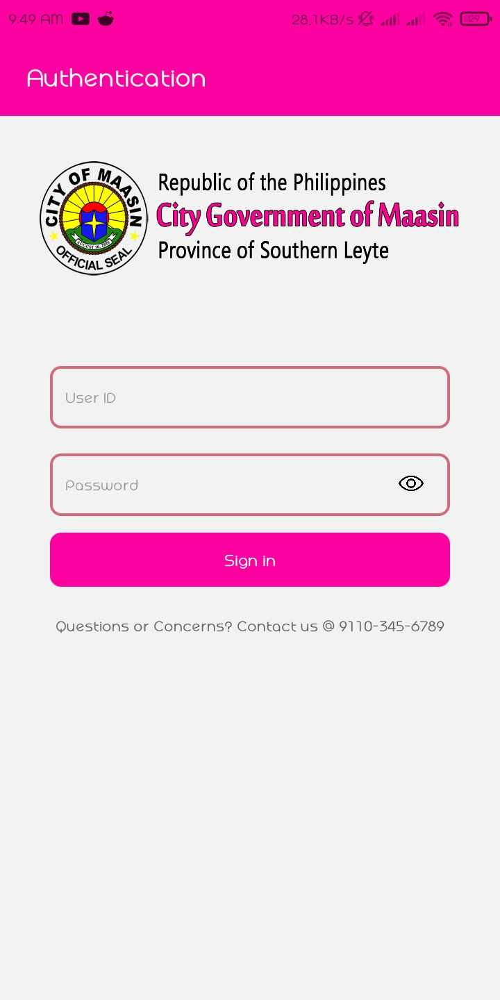
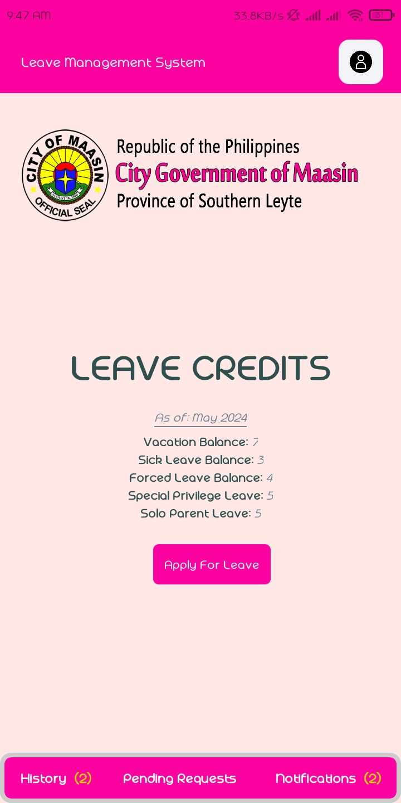
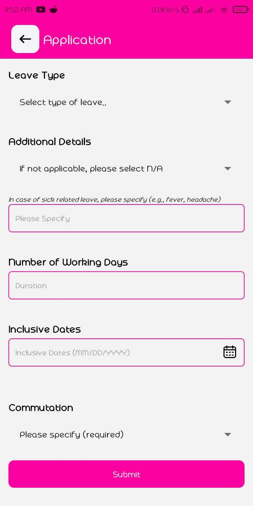

# Streamlined Leave Management System

The Streamlined Leave Management System is a mobile application developed using React Native with Expo. It is designed to simplify and optimize the employee leave management process.

APK Download link: [https://mega.nz/file/vfI1yIqK#l1qijx3TcpcQRepQV6r2-90YBC5CX7hEkyQts-s2j0g](https://mega.nz/file/vfI1yIqK#l1qijx3TcpcQRepQV6r2-90YBC5CX7hEkyQts-s2j0g)

> Note: The file responsible for sending and fetching data is located at `components/servercon/api.js`. The actual base URL configuration has been omitted for privacy reasons.

[Click here to access the REST API Repository](https://github.com/qw87rt/Expressjs--LeaveManagement_restapi)

[or click here to access the Desktop App repo](https://github.com/qw87rt/VB.NET--LeaveManagementPC)


## Table of Contents

- [Screenshots](#screenshots)
- [Key Features](#key-features)
- [Technologies Used](#technologies-used)
- [Installation](#installation)
- [Usage](#usage)
- [Known Issues](#known-issues)
- [Contributing](#contributing)
- [License](#license)
- [Contact](#contact)

## Screenshots

<table>
  <tr>
    <td></td>
    <td></td>
    <td></td>
  </tr>
</table>


## Key Features

- Mobile-friendly leave request submission
- Real-time leave balance tracking


## Technologies Used


## Installation

1. Clone the repository:
   ```sh
   git clone https://github.com/qw87rt/LeaveManagementMobileApp
   ```

2. Navigate to the project directory:
   ```sh
   cd LeaveManagementMobileApp
   ```

3. Install the required dependencies:
   ```sh
   npm install
   ```

4. Launch the development server:
   ```sh
   npm start
   ```

5. Use the Expo Go app on your mobile device to scan the QR code displayed in the terminal or Expo Dev Tools.

> Note: The file responsible for sending and fetching data is located at `components/servercon/api.js`. The actual base URL configuration has been omitted for privacy reasons.

## Usage

1. Install & Launch the Streamlined Leave Management System app on your mobile device.
   
   Download link: [https://mega.nz/file/vfI1yIqK#l1qijx3TcpcQRepQV6r2-90YBC5CX7hEkyQts-s2j0g](https://mega.nz/file/vfI1yIqK#l1qijx3TcpcQRepQV6r2-90YBC5CX7hEkyQts-s2j0g)

2. Log in using the provided credentials below:

   ```
   UserID: 100182
   Password: nw2pak
   ```
               
3. Navigate through the app to perform various tasks:
   - Submit leave requests
   - View your current leave balance
   - Monitor the status of your leave requests

## Known Issues

The Streamlined Leave Management System needs to be rewritten for optimization.

## Contributing

Contributions are welcome! If you have any suggestions, bug reports, or feature requests, please open an issue or submit a pull request.

## License

This project is licensed under the [MIT License](LICENSE).

## Contact

For any inquiries or questions, please reach out at [jhunrayomiping@gmail.com](mailto:jhunrayomiping@gmail.com).

---
